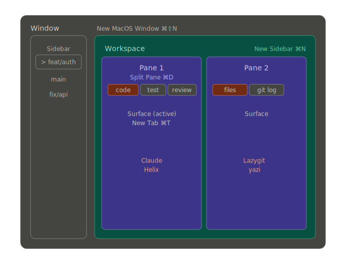

# Agentic-TUI 🚀

> **The Agent-native TUI development environment for macOS.**
> 
> 
> 
> 
> 

Config managed via GNU Stow, designed for **parallel AI agent execution** and friction-less human-machine synergy.

---

<!--
## 📸 Preview

TODO: Add an HD screenshot of the 3-pane layout (Helix | Claude | Yazi/LazyGit)

-->

## Architecture (cmux)

The diagram below shows the hierarchical structure provided by the **cmux** app:

| Layer | Mapping | Example |
|-------|---------|---------|
| **Window** | Project | `myapp` |
| **Workspace** | Git Worktree / Branch | `myapp · feat/auth` |
| **Pane** | Task Zone | editor / agent / files |
| **Surface** | Tool Tab | `[claude] [helix] [lazygit]` |

Each workspace uses a fixed 3-pane layout: **Helix** (editor) | **Claude/Agent** (AI agent) | **Yazi/LazyGit** (files/git).

---

## ⚡ Quick Start

Copy this repo URL and send it to your AI agent (Claude Code / Gemini CLI) with:

> "Read [**AGENTS.md**](./AGENTS.md) from this repo and follow its instructions to set up this TUI dev environment on my macOS."

The agent will handle: dependency installation, config backup & merge, Stow deployment, and verification. (It will also offer a **One-Shot** fast-track if you prefer the recommended defaults).

---

## Tools

| Category | Tool |
|----------|------|
| Window / Layout | [cmux](https://cmux.com/) |
| Editor | [Helix](https://helix-editor.com/) |
| AI Agent | [Claude Code](https://docs.anthropic.com/en/docs/claude-code) / [Gemini CLI](https://github.com/google-gemini/gemini-cli) |
| File Manager | [Yazi](https://yazi-rs.github.io/) |
| Git Interface | [LazyGit](https://github.com/jesseduffield/lazygit) |
| Worktree Manager | [worktrunk](https://github.com/max-sixty/worktrunk) |
| Shell / Prompt | [Fish](https://fishshell.com/) + [Starship](https://starship.rs/) |
| Spec-Driven Dev | [OpenSpec](https://github.com/Fission-AI/OpenSpec) or [SpecKit](https://github.com/github/spec-kit) |
| Config Management | [GNU Stow](https://www.gnu.org/software/stow/) |

---

## Docs

| File | Purpose |
|------|---------|
| [AGENTS.md](./AGENTS.md) | Standard setup guide — give this to your AI agent |
| [ONESHOT.md](./ONESHOT.md) | One-shot (opinionated) setup — zero interaction |
| [CLAUDE.md](./CLAUDE.md) | Design specs & dev workflow (maintainer reference) |
| [KEYMAP.md](./KEYMAP.md) | Cheat sheet for all tool shortcuts |

## Principles

- **Tooling for Humans**: OOTB tools serve human intent first.
- **Agent-First Flow**: Every layer optimized for AI agent interaction.
- **Frictionless Interaction**: Full GNU Readline (Emacs-style) keybindings, zero shortcut collisions across the stack.
